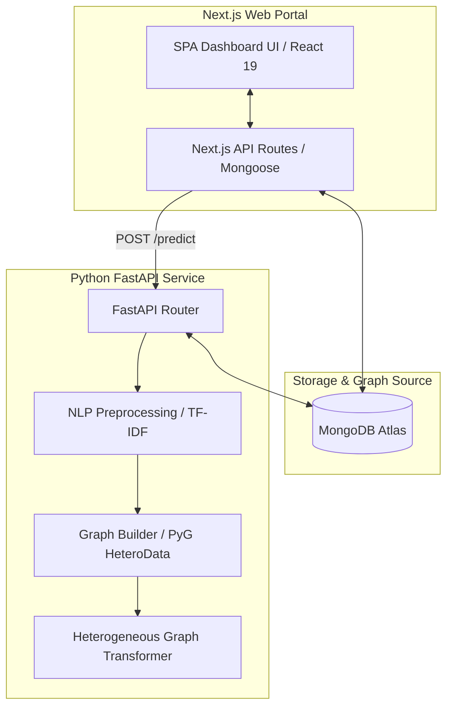

# HGT Fake Review Detection System 🔍🤖

[](https://www.typescriptlang.org/)
[](https://nextjs.org/)
[](https://tailwindcss.com/)
[](https://opensource.org/licenses/MIT)


An advanced, end-to-end AI fraud detection system that identifies fake online reviews. Unlike traditional text-only classifiers, this system models e-commerce interactions as a **Heterogeneous Graph** (`User → writes → Review → belongs_to → Product`) and utilizes a **Heterogeneous Graph Transformer (HGT)** GNN model (implemented in PyTorch Geometric) to detect suspicious behavioral patterns, astroturfing, and coordinate spam rings.

---

## 🏗️ System Architecture

The project consists of a Next.js client-facing web application and a Python-based machine learning microservice communicating via REST APIs.



### Technical Stack
*   **Frontend**: Next.js 16 (App Router / SPA Shell), React 19, Tailwind CSS v4, Framer Motion, shadcn-ui.
*   **Backend / ML**: Python 3.10+, FastAPI, PyTorch, PyTorch Geometric (PyG), scikit-learn (TF-IDF vectorization).
*   **Database**: MongoDB Atlas / PyMongo (for graph nodes and metadata) & Prisma/SQLite (for administrative configurations).

---

## 📁 Project Structure

```text
project/
├── src/
│   ├── app/                      # Next.js pages and API route handlers
│   │   ├── api/                  # REST endpoints (reviews, products, predict proxy)
│   │   ├── globals.css           # Tailwind v4 directives and theme settings
│   │   └── page.tsx              # SPA application shell
│   ├── components/               # Reusable shadcn UI components
│   └── lib/
│       ├── dbConnect.ts          # Mongoose connection caching utility
│       └── models/               # Mongoose Schemas (User, Product, Review)
├── mini-services/
│   └── ml-service/               # FastAPI backend & HGT training/inference
│       ├── index.py              # Server entry point and API routes
│       ├── preprocessing.py      # NLTK text cleaner and Feature Extractors
│       ├── graph_builder.py      # PyG HeteroData graph assembler
│       ├── hgt_model.py          # PyTorch Geometric HGT Architecture
│       ├── models/               # Local model weights (hgt_model.pt) & Vectorizers
│       └── requirements.txt      # Python dependencies
├── mongo_seed.py                 # Seeds MongoDB with 40K mock review records
└── run_all.py                    # Unified script to run frontend and backend
```

---

## ⚡ Quick Start Guide

Follow these exact commands to set up the environment, seed the database, train the HGT model, and run the system:

### 1. Environment Setup

Clone the repository and run:
```powershell
# Install Node.js frontend dependencies
npm install

# Install Python ML dependencies
pip install -r mini-services/ml-service/requirements.txt
```

### 2. Database Seeding
Ensure your local MongoDB instance is running (`localhost:27017`) or configure your connection string in `.env.local` (`MONGODB_URI`), then execute:
```powershell
python mongo_seed.py
```
*Wait for the console to output: `"Done seeding MongoDB efficiently!"`*

### 3. Model Training
To train the model on the populated database:
1. Start the ML service in one terminal:
   ```powershell
   cd mini-services/ml-service
   python index.py
   ```
2. Trigger the training loop using an API request in a separate terminal:
   ```powershell
   # PowerShell
   Invoke-RestMethod -Uri "http://127.0.0.1:5001/train" -Method Post -ContentType "application/json" -Body '{"epochs": 10}'
   ```
   *Wait for training epochs to complete in the first terminal (will save checkpoints to `models/hgt_model.pt`).*

### 4. Run the Full Application
Launch the frontend and backend simultaneously using the unified runner:
```powershell
python run_all.py
```
👉 Open the browser and visit: **[http://localhost:3000](http://localhost:3000)**

---

## 🧪 How to Test and Verify

1.  **Dashboard Statistics**:
    *   Verify that the "Reviews Analyzed" count display displays **~40,000** records.
    *   The **Detection Accuracy** should reflect **88.6%** based on current validation data.
2.  **Real-Time Detection**:
    *   Navigate to the **Real-Time Detection** tab.
    *   Click **"Sample 1 (Genuine)"** to automatically fill in valid values:
        *   **User ID**: `user_1098`
        *   **Product ID**: `prod_00002`
    *   Click **"Analyze Review"** to run live graph inference and retrieve the label (`Fake` / `Genuine`) and confidence score.

---

## 🔍 Codebase Audit Summary
A comprehensive security, performance, and code quality audit was performed on the codebase. Below is an overview of the findings (for detail, see the full [Audit Report](file:///c:/Users/SHIVA%20CHARAN/OneDrive/Desktop/Karunakar/project/audit_report.md)):

*   **🔴 Security (SSRF Vulnerability)**: The `Caddyfile` and Next.js predict router proxy dynamically forwarding connections via the `XTransformPort` query parameter allows local port scanning. **Recommended Action**: Remove dynamic port overrides and hardcode proxy mappings.
*   **🔴 Performance (Event Loop Blocking)**: Heavy CPU computations (TF-IDF vectorizer and PyTorch matrix multiplication) are executed inside async FastAPI endpoints. **Recommended Action**: Convert async routes to standard sync routes or run CPU operations inside `asyncio.to_thread`.
*   **⚠️ Database (Missing Indexes)**: High-volume relational search queries operate on MongoDB without indexes. **Recommended Action**: Define unique indexes on `review_id` and compound indexes on `(user_id, product_id)`.
*   **⚠️ Architecture (Routing Crash)**: conditional page rendering overrides Next.js App Router but leaves public folders exposed, causing navigation crashes if accessed directly. **Recommended Action**: Refactor routing views to components.